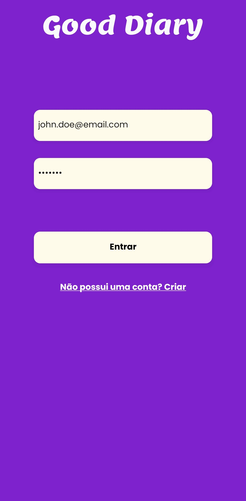
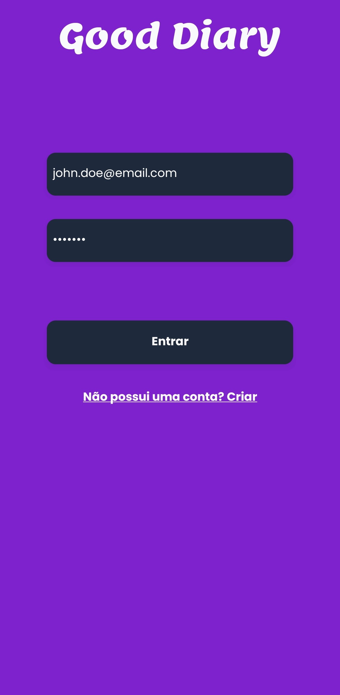
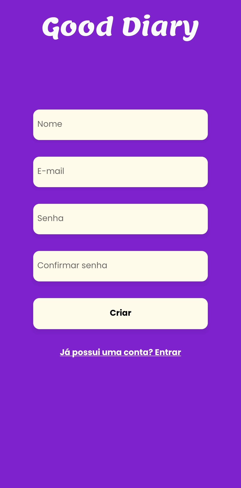
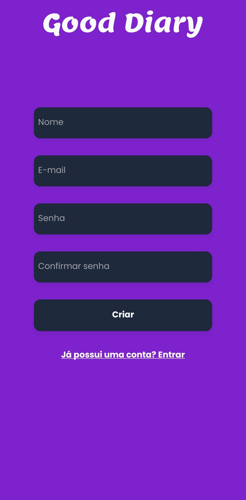
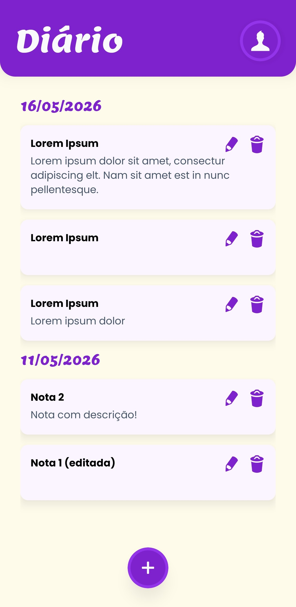
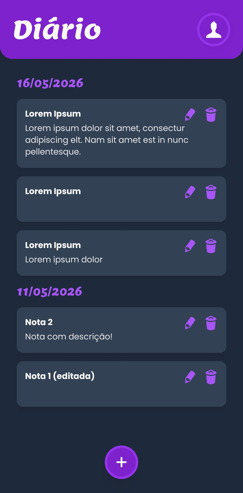
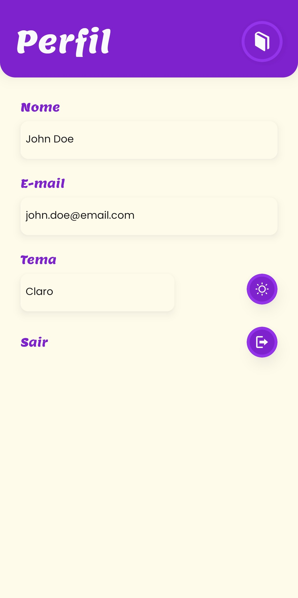
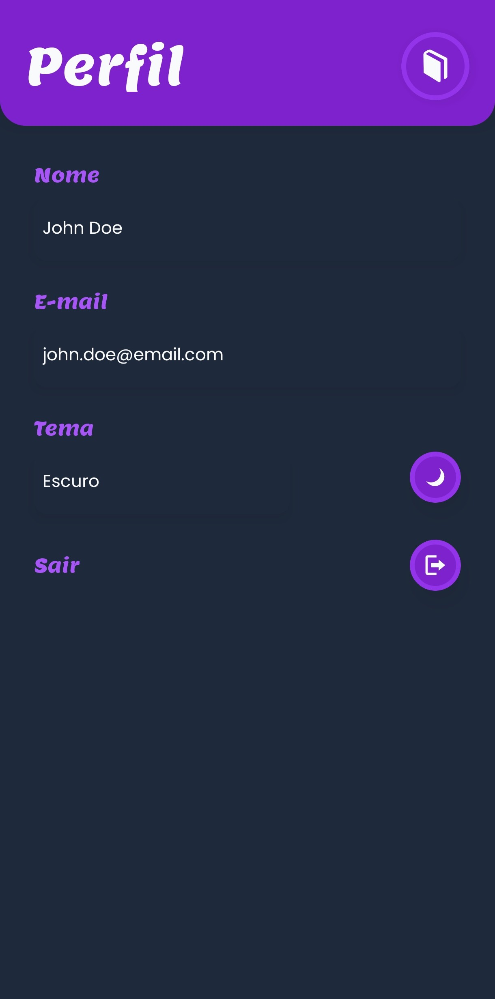

<div align="center"><h1> 📓 Good Diary App 📱</h1></div>

O aplicativo do **Good Diary** consiste em um software para a manipulação de registros de notas de um usuário, com temas claro e escuro.

O sistema consiste em um software feito para servir como diário pessoal, onde o usuário pode escrever notas sobre o seu dia, consultá-las, editá-las e excluí-las.

## Ferramentas ✂️

<div style="display: inline-block">
  
  
  
  
  
  
  
</div>

## Configuração Inicial 🛠️

Antes de rodar a aplicação, certifique-se de que o projeto da [API](https://github.com/rafaelsantiagosilva/good-diary-backend) esteja rodando.

Crie um arquivo `.env` na raiz do projeto e preencha as variáveis abaixo:

```conf
EXPO_PUBLIC_API_URL=http://localhost:3000 # URL da API rodando.
# Caso esteja rodando em um celular de fato, utilizar URL com IP da máquina da API.
```

## Telas da Aplicação 📲

### Login

- Função de realizar o login do usuário.

<p align="center" style="display: flex; gap:5px">
  
  
</p>

### Criar conta

- Função de criar uma conta e logo em seguida realizar o login do usuário.

<p align="center" style="display: flex; gap:5px">
  
  
</p>

### Home

- Listagem das notas e as possibilidades de:
  - Criação de uma nova
  - Edição de uma nota
  - Exclusão de uma nota

<p align="center" style="display: flex; gap:5px">
  
  
</p>

### Perfil

- Informações sobre o usuário
- Mudar o tema da aplicação

<p align="center" style="display: flex; gap:5px">
  
  
</p>

## Comandos ⌨️

### 1. Instalação

```bash
# Instalar dependências
pnpm install
```

### 2. Criar os serviços da API

```bash
# Tenha certeza de ter preenchido o .env adequadamente
pnpm api:generate
```

### 3. Execução

```bash
# Iniciar execução pelo Expo
pnpm start

# Abrir o app em uma máquina Android conectada ou VM
pnpm android

# Abrir o app em uma máquina IOS conectada ou VM
pnpm ios
```

<div align="center"><span style="font-size: 0.7em;">🦇 Feito com 💜</span></div>